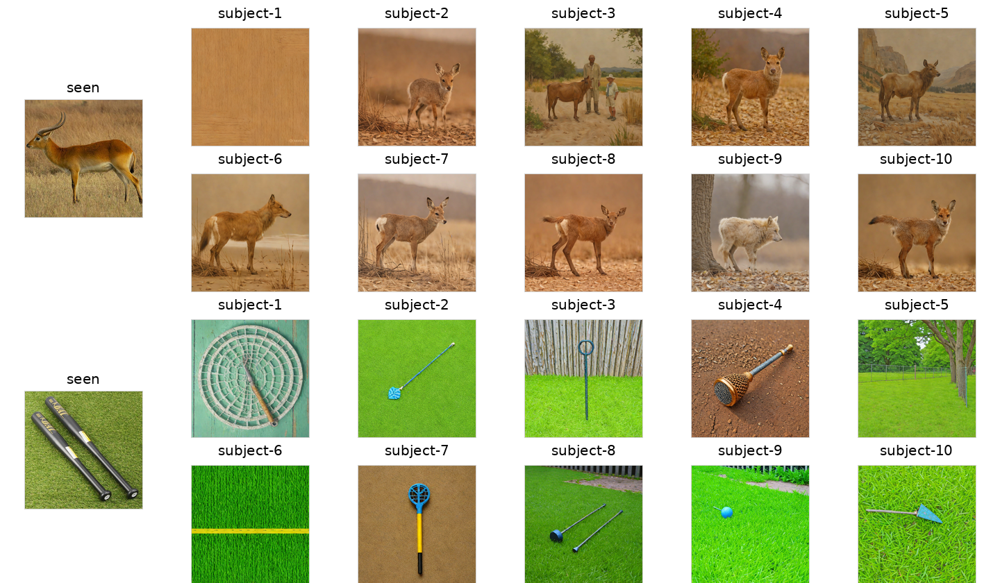

# BRIDGE: Brain-Vision Representation Integration through Depth and Granularity Encoding

**Official implementation of BRIDGE: Brain-Vision Representation Integration through Depth and Granularity Encoding (NeurIPS 2026).**

[Repository](https://github.com/hcy1026/BRIDGE)

BRIDGE, a brain-vision representation integration framework that aligns two modalities through Visual Depth Encoding and Brain Granularity Encoding. BRIDGE extracts and fuses LAION CLIP ViT-B-32 representations from multiple depths, explicitly partitions stimulus-evoked EEG/MEG responses into a small number of temporally ordered stages. The resulting brain and visual embeddings are trained in a shared latent space by contrastive learning and can further support brain-to-image generation through a pretrained diffusion prior. 

## Overview

The repository follows four main stages:

1. **Extract visual embeddings** from a pretrained multi-depth CLIP encoder.
2. **Train the brain–vision model** for intra-subject or inter-subject retrieval.
3. **Train the image-to-diffusion prior** with visual data and the pretrained SDXL/IP-Adapter components.
4. **Reconstruct images from EEG/MEG**, using the trained brain-side encoder and generation conditioning pathway.

> **Reproducibility note:** The commands below retain the script names from the repository documentation supplied by the authors. Verify configuration variables, paths, checkpoint handling, and dependency versions against the corresponding scripts before running. Dataset splits, evaluation settings, and generation checkpoints must match the paper.

## 0. Environment

```bash
git clone https://github.com/hcy1026/BRIDGE.git
cd BRIDGE

conda create -n bridge python=3.13 -y
conda activate bridge

# PyTorch CUDA 12.6 build; requires a compatible NVIDIA driver.
pip install torch==2.9.1+cu126 torchvision==0.24.1+cu126 --index-url https://download.pytorch.org/whl/cu126
pip install -r requirements.txt
pip install git+https://github.com/openai/CLIP.git
```

## 1. Prepare data & pretrained weights

### Datasets

The scripts assume the following layout:

```text
<BASE_DIR>/
  data/
    things-eeg/
      Preprocessed_data_250Hz_whiten/   # EEG numpy / mat files
      ...                               # THINGS images live under this folder
      embeddings/                       # output from build_embeddings
    things-meg/
      Preprocessed_data/                # MEG numpy / mat files
      ...
      embeddings/
    visual-layer/
      imagenet-1k-vl-enriched/
        data/                           # ImageNet images
        embeddings/                     # output from build_embeddings
```
Data sources:
  - EEG: [things-eeg](https://huggingface.co/datasets/Haitao999/things-eeg)
  - MEG: [things-meg](https://huggingface.co/datasets/Haitao999/things-meg)
  - ImageNet: [imagenet-1k-vl-enriched](https://huggingface.co/datasets/visual-layer/imagenet-1k-vl-enriched)
### Pretrained diffusion (SDXL) + IP-Adapter weights

Prior training uses SDXL-base and inference uses SDXL-turbo for fast sampling 
Requirements:

- **SDXL base** (HuggingFace ID): `stabilityai/stable-diffusion-xl-base-1.0`
- **SDXL turbo** (HuggingFace ID): `stabilityai/sdxl-turbo`
- **SDXL IP-Adapter weights**: a single `*.safetensors` file: `h94/IP-Adapter/sdxl_models/ip-adapter_sdxl_vit-h.safetensors`

We recommend storing them under:

```text
<BASE_DIR>/
  pretrained/
    ip-adapter_sdxl.safetensors
    stable-diffusion-xl-base-1.0
    ...
  priors/              # output of train_prior.sh
```

### Visual encoders

`build_embeddings.sh` can build multistage embeddings from pretrained visual CLIP ViT-B/32 - LAION-2B encoder. By default it looks under:

```text
<BASE_DIR>/pretrained/laion/CLIP-ViT-B-32-laion2B-s34B-b79K
```

If you prefer to load from HuggingFace directly from `laion/CLIP-ViT-B-32-laion2B-s34B-b79K` , set `MODEL_PATH` in `scripts/build_embeddings.sh` to the HF IDs instead of local files.

## 2. Build visual embeddings

```bash
bash scripts/build_embeddings.sh
```

## 3. Train brain-vision contrastive model

```bash
# Intra-subject
bash scripts/train_clip_intra.sh

# Inter-subject
bash scripts/train_clip_inter.sh
```

## 4. Train prior

```bash
bash scripts/train_prior.sh
```
## 5. Build reconstruction

Reconstruction uses a pretrained Prior.

```bash
bash scripts/build_reconstruction.sh
```


## Results

Our model achieves the following performances on :

### Brain-to-Image Retrieval on THINGS-EEG and THINGS-MEG

| Dataset  | Intra Top 1 Accuracy  | Intra Top 5 Accuracy | Inter Top 1 Accuracy | Inter Top 5 Accuracy |
|----------|-----------------------| -------------------- | -------------------- | -------------------- |
|THINGS-EEG|          80.7%        |      97.0%           |         33.7%        |      65.8%           |
|THINGS-MEG|          33.1%        |      61.5%           |         7.4%         |      19.3%           |

### Reconstruction evaluation


| Dataset / setting | PixCorr ↑ | SSIM ↑ | AlexNet(2) ↑ | AlexNet(5) ↑ | Inception ↑ | CLIP ↑ | SwAV ↓ |
|---|---:|---:|---:|---:|---:|---:|---:|
| THINGS-EEG (10-subject average) | 0.163 | 0.304 | 0.799 | 0.855 | 0.699 | 0.736 | 0.602 |
| THINGS-EEG (subject 8) | 0.188 | 0.332 | 0.821 | 0.868 | 0.726 | 0.764 | 0.584 |
| THINGS-MEG (4-subject average) | 0.104 | 0.258 | 0.672 | 0.774 | 0.679 | 0.697 | 0.644 |





## Citation

If you find this project useful, please cite the BRIDGE paper. Replace the provisional bibliographic details below with the official NeurIPS proceedings record once available:

```bibtex
@inproceedings{hong2026bridge,
  title={BRIDGE: Brain-Vision Representation Integration through Depth and Granularity Encoding},
  author={Hong, Chenyuan and Ye, Binghao and Guo, Yufei and Qi, Liguo},
  booktitle={Advances in Neural Information Processing Systems},
  year={2026}
}
```

## Related work

- [Learning Brain Representation with Hierarchical Visual Embeddings (BrainHiVE)](https://openreview.net/forum?id=IEq71qS8B7)
- [Bridging the Vision-Brain Gap with an Uncertainty-Aware Blur Prior](https://arxiv.org/abs/2503.04207)
- [Visual Decoding and Reconstruction via EEG Embeddings with Guided Diffusion](https://proceedings.neurips.cc/paper_files/paper/2024/hash/ba5f1233efa77787ff9ec015877dbd1f-Abstract-Conference.html)


